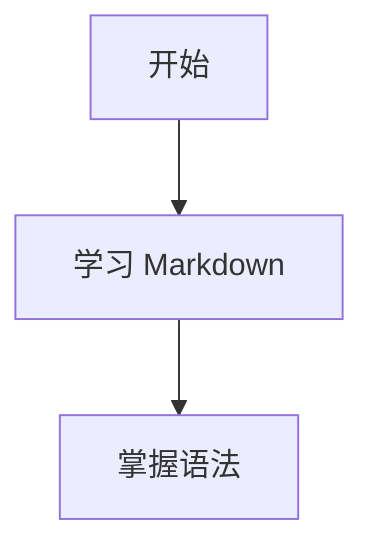

<h2>Markdown 语法笔记</h2>
## 1. Markdown 是什么

Markdown 是一种**轻量级标记语言**，用简洁的纯文本语法来表示标题、列表、引用、代码、表格等结构，常用于：

- 文档编写
- README 说明
- 博客写作
- 笔记整理
- 技术文档
- 评论区排版

它的核心特点是：

- 语法简单
- 可读性强
- 纯文本易保存
- 可转换为 HTML、PDF 等格式

---

## 2. 标题

使用 `#` 表示标题，`#` 的数量对应标题级别。

```markdown
# 一级标题
## 二级标题
### 三级标题
#### 四级标题
##### 五级标题
###### 六级标题
```

效果：

# 一级标题
## 二级标题
### 三级标题
#### 四级标题
##### 五级标题
###### 六级标题

注意：

- `#` 后面通常加一个空格
- 最多支持六级标题

---

## 3. 段落与换行

### 3.1 段落

直接书写文字即可，一个自然段之间通常空一行。

```markdown
这是第一段。

这是第二段。
```

### 3.2 换行

Markdown 中直接回车通常**不会立即换行**。常见换行方式有：

#### 方法一：行尾加两个空格

```markdown
第一行  
第二行
```

#### 方法二：使用 HTML 的 `<br>`

```markdown
第一行<br>
第二行
```

---

## 4. 强调语法

### 4.1 斜体

```markdown
*斜体*
_斜体_
```

效果：

*斜体*

### 4.2 粗体

```markdown
**粗体**
__粗体__
```

效果：

**粗体**

### 4.3 粗斜体

```markdown
***粗斜体***
___粗斜体___
```

效果：

***粗斜体***

### 4.4 删除线

```markdown
~~删除线~~
```

效果：

~~删除线~~

### 4.5 高亮

部分 Markdown 平台支持：

```markdown
==高亮==
```

注意：`==高亮==` **不是所有平台都支持**。

---

## 5. 引用

使用 `>` 表示引用。

```markdown
> 这是一段引用文字。
```

效果：

> 这是一段引用文字。

多级引用：

```markdown
> 一级引用
>> 二级引用
>>> 三级引用
```

效果：

> 一级引用
>> 二级引用
>>> 三级引用

引用中也可以嵌套其他语法：

```markdown
> ## 引用中的标题
> - 列表项
> **加粗内容**
```

---

## 6. 列表

### 6.1 无序列表

使用 `-`、`*` 或 `+`。

```markdown
- 苹果
- 香蕉
- 橙子
```

或

```markdown
* 苹果
* 香蕉
* 橙子
```

或

```markdown
+ 苹果
+ 香蕉
+ 橙子
```

效果：

- 苹果
- 香蕉
- 橙子

注意：

- 同一层级尽量统一符号
- 符号后加空格

### 6.2 有序列表

使用数字加 `.`

```markdown
1. 第一步
2. 第二步
3. 第三步
```

效果：

1. 第一步
2. 第二步
3. 第三步

### 6.3 嵌套列表

子项通常缩进 2 或 4 个空格。

```markdown
1. 水果
   - 苹果
   - 香蕉
2. 蔬菜
   - 西红柿
   - 黄瓜
```

效果：

1. 水果
   - 苹果
   - 香蕉
2. 蔬菜
   - 西红柿
   - 黄瓜

### 6.4 任务列表

很多平台支持任务列表：

```markdown
- [ ] 待完成
- [x] 已完成
```

效果：

- [ ] 待完成
- [x] 已完成

注意：

- `[ ]` 中间有空格表示未完成
- `[x]` 表示已完成

---

## 7. 链接

### 7.1 行内链接

```markdown
[百度](https://www.baidu.com)
```

效果：

[百度](https://www.baidu.com)

### 7.2 带标题的链接

```markdown
[百度](https://www.baidu.com "这是百度")
```

### 7.3 引用式链接

```markdown
[百度][1]
[OpenAI][2]

[1]: https://www.baidu.com
[2]: https://www.openai.com
```

适合长文档统一管理链接。

### 7.4 自动链接

```markdown
<https://www.baidu.com>
<test@example.com>
```

效果：

<https://www.baidu.com>  
<test@example.com>

---

## 8. 图片

语法和链接很像，只是前面多一个 `!`

```markdown

```

### 8.1 带标题的图片

```markdown

```

### 8.2 引用式图片

```markdown
![Logo][logo]

[logo]: https://example.com/logo.png
```

注意：

- `[]` 中内容是图片无法显示时的替代文本
- Markdown 原生语法通常**不能直接设置宽高**
- 如果平台支持 HTML，可写：

```html

```

---

## 9. 行内代码与代码块

### 9.1 行内代码

使用一对反引号 `` ` ``

```markdown
请使用 `print()` 输出内容。
```

效果：

请使用 `print()` 输出内容。

### 9.2 代码块

使用三个反引号包裹。

````markdown
```markdown
这是代码块
```
````

示例：

```markdown
def hello():
    print("Hello, Markdown!")
```

### 9.3 指定语言

可以在开头的三个反引号后写语言名，便于高亮：

````markdown
```python
def hello():
    print("Hello")
```
````

效果：

```python
def hello():
    print("Hello")
```

常见语言标识：

- `python`
- `javascript`
- `java`
- `c`
- `cpp`
- `html`
- `css`
- `bash`
- `json`
- `yaml`
- `markdown`

### 9.4 缩进代码块

也可用 4 个空格或 1 个制表符缩进：

```markdown
    这也是代码块
```

但实际使用中更推荐三个反引号，清晰且方便标注语言。

---

## 10. 分隔线

使用三个或更多的 `-`、`*` 或 `_`

```markdown
---
***
___
```

效果：

---

注意：

- 单独占一行
- 常用于章节分隔

---

## 11. 表格

基本写法：

```markdown
| 姓名 | 年龄 | 城市 |
| ---- | ---- | ---- |
| 张三 | 18   | 北京 |
| 李四 | 20   | 上海 |
```

效果：

| 姓名 | 年龄 | 城市 |
| ---- | ---- | ---- |
| 张三 | 18 | 北京 |
| 李四 | 20 | 上海 |

### 11.1 对齐方式

```markdown
| 左对齐 | 居中对齐 | 右对齐 |
| :----- | :------: | -----: |
| A      | B        | C      |
| D      | E        | F      |
```

效果：

| 左对齐 | 居中对齐 | 右对齐 |
| :----- | :------: | -----: |
| A | B | C |
| D | E | F |

说明：

- `:---` 左对齐
- `:---:` 居中
- `---:` 右对齐

---

## 12. 转义字符

如果想显示 Markdown 语法符号本身，可在前面加反斜杠 `\`

```markdown
\*这不是斜体\*
\# 这不是标题
\`这不是代码\`
```

效果：

\*这不是斜体\*  
\# 这不是标题  
\`这不是代码\`

常见可转义字符：

```markdown
\ 反斜杠
` 反引号
* 星号
_ 下划线
{} 花括号
[] 方括号
() 小括号
# 井号
+ 加号
- 减号
. 点
! 感叹号
```

---

## 13. HTML 混写

许多 Markdown 解析器支持直接嵌入 HTML：

```html
<b>加粗</b>
<i>斜体</i>
<br>
<div>内容</div>
```

常见用途：

- 强制换行
- 设置图片大小
- 插入复杂布局
- 使用更丰富样式

注意：

- 不同平台对 HTML 支持不同
- 有些平台会过滤危险标签

---

## 14. 常见扩展语法

不同平台常支持一些扩展，不属于最基础标准，但很常见。

### 14.1 脚注

```markdown
这是一个脚注示例[^1]

[^1]: 这里是脚注内容。
```

### 14.2 定义列表

部分平台支持：

```markdown
术语
: 解释内容
```

### 14.3 数学公式

有些平台支持 LaTeX 公式。

行内公式：

```markdown
$E = mc^2$
```

块级公式：

```markdown
$$
a^2 + b^2 = c^2
$$
```

### 14.4 目录

部分编辑器支持根据标题自动生成目录，例如：

```markdown
[TOC]
```

注意：并非所有平台支持。

### 14.5 Mermaid 图表

部分平台支持 Mermaid：

````markdown

````

---

## 15. Markdown 与平台差异

Markdown 并不是完全统一的，不同平台支持的语法会有区别。

常见版本或实现：

- CommonMark
- GitHub Flavored Markdown，简称 GFM
- Markdown Extra
- Typora 扩展语法
- 各博客平台自定义扩展

常见差异体现在：

- 是否支持表格
- 是否支持任务列表
- 是否支持脚注
- 是否支持数学公式
- 是否支持 HTML
- 是否支持目录 `[TOC]`
- 是否支持高亮 `==内容==`

因此编写文档时要注意目标平台。

---

## 16. Markdown 编写规范建议

### 16.1 标题层级清晰

推荐：

- 一个文档通常只有一个一级标题
- 二级标题用于大章节
- 三级标题用于小节
- 不要跳级过多

例如：

```markdown
# Python 学习笔记

## 基础语法
### 变量
### 条件语句

## 函数
### 定义函数
### 参数传递
```

### 16.2 列表风格统一

同一文档中：

- 无序列表尽量统一使用 `-`
- 有序列表统一用 `1. 2. 3.`
- 保持缩进一致

### 16.3 代码块标注语言

推荐：

````markdown
```python
print("hello")
```
````

不推荐：

````markdown
```
print("hello")
```
````

因为标注语言后更易读。

### 16.4 合理留白

建议：

- 标题前后适当空行
- 段落间空一行
- 表格、代码块、列表与正文适当分隔

这样文档更清晰。

### 16.5 一行不要过长

适合阅读和版本管理，尤其是技术文档。

### 16.6 善用引用、表格、列表

- 说明步骤时用有序列表
- 枚举特点时用无序列表
- 参数对比时用表格
- 提示信息可用引用

---

## 17. 常见错误

### 17.1 `#` 后忘记加空格

错误：

```markdown
#标题
```

推荐：

```markdown
# 标题
```

### 17.2 列表符号后忘记空格

错误：

```markdown
-苹果
```

推荐：

```markdown
- 苹果
```

### 17.3 代码块没有闭合

错误：

````markdown
```python
print("hello")
````

推荐：

````markdown
```python
print("hello")
```
````

### 17.4 表格竖线不规范

虽然很多编辑器能容错，但建议写整齐。

### 17.5 换行方式理解错误

很多初学者以为直接回车就会换行，实际上很多 Markdown 环境中不会。

---

## 18. 实用示例

### 18.1 简单笔记模板

````markdown
# 今日学习笔记

## 学习内容

今天学习了 Markdown 的基础语法，包括：

- 标题
- 列表
- 引用
- 代码块

## 重点示例

### Python 示例

```python
print("Hello, Markdown!")
```

## 总结

Markdown 适合写文档，语法简单，排版清晰。
````

### 18.2 README 模板

````markdown
# 项目名称

## 项目简介

这是一个用于学习 Markdown 的示例项目。

## 功能特点

- 简单易用
- 结构清晰
- 支持扩展

## 安装方法

```bash
git clone https://example.com/demo.git
cd demo
```

## 使用方法

运行以下命令：

```bash
python main.py
```

## 目录结构

| 文件 | 说明 |
| ---- | ---- |
| main.py | 主程序 |
| README.md | 项目说明 |

## License

MIT
````

---

## 19. 常用速查表

| 功能 | 语法 |
| ---- | ---- |
| 一级标题 | `# 标题` |
| 二级标题 | `## 标题` |
| 粗体 | `**文字**` |
| 斜体 | `*文字*` |
| 删除线 | `~~文字~~` |
| 引用 | `> 引用内容` |
| 无序列表 | `- 项目` |
| 有序列表 | `1. 项目` |
| 行内代码 | `` `代码` `` |
| 代码块 | `` ```语言 `` |
| 链接 | `[名称](地址)` |
| 图片 | `` |
| 分隔线 | `---` |
| 表格 | `| 列1 | 列2 |` |
| 任务列表 | `- [ ] 任务` |
| 脚注 | `[^1]` |

---

## 20. 学习建议

学习 Markdown 最好的方式不是死记，而是边写边练。推荐练习路径：

1. 先掌握标题、段落、强调、列表
2. 再学习链接、图片、代码块、引用
3. 然后练习表格、任务列表、脚注等扩展语法
4. 最后结合实际写一篇完整笔记或 README

适合新手的练习任务：

- 写一篇自我介绍
- 写一份课程笔记
- 写一个项目 README
- 整理一份读书笔记

---

## 21. 结语

Markdown 的本质不是“花哨排版”，而是用**尽可能简单的语法，写出结构清晰、便于阅读的文档**。

你可以继续围绕这份笔记做三类练习：

- 对照语法手打一遍
- 自己写一份 README
- 把课堂笔记改写成 Markdown


<section class="legacy-comments">
  <h2>评论区</h2>
  <div id="twikoo-article_1775191607175" data-twikoo-path="article_1775191607175"></div>
</section>
